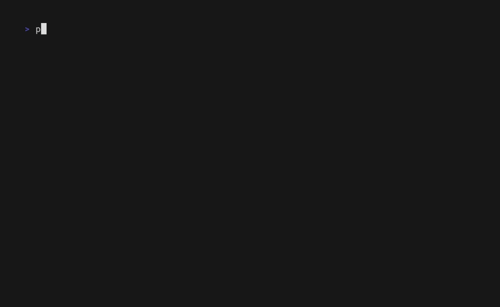

# What is this?

this is a way to recreate a set of terminals and commands with tmux 


made with [vhs](https://github.com/charmbracelet/vhs/)

## Why?
I just find anoying manually setting up local servers every day

## How to install?

### With Go
```bash
go install github.com/jhonnyV-V/phoemux@latest
```

### Compile it yourself

```bash
git clone git@github.com:jhonnyV-V/phoemux && cd phoemux
```
```bash
go mod tidy
```
```bash
go build -o phoemux
```
```bash
sudo mv ./phoemux /usr/local/bin
```

## Available Commands

### create
```bash
phoemux create <alias>
```
create a config file that I like to call ash with the default values pointing to the current path
and open the "ash" with the $EDITOR env variable or nano as a default

### delete
```bash
phoemux delete <alias>
```
delete a config file (ash)

### edit
```bash
phoemux edit <alias>
```
open the "ash" with the $EDITOR env variable or nano as a default

### list
```bash
phoemux list
```
list all the configs files (or ashes) created and if you select one it execute it


### last
```bash
phoemux last
```
if possible open the last as used


### execute
```bash
phoemux <alias>
```
set up tmux session following the config file or ash related to that alias

## Changelog

- now if a session for an "ash" already exist phoemux will attach or switch to that session
